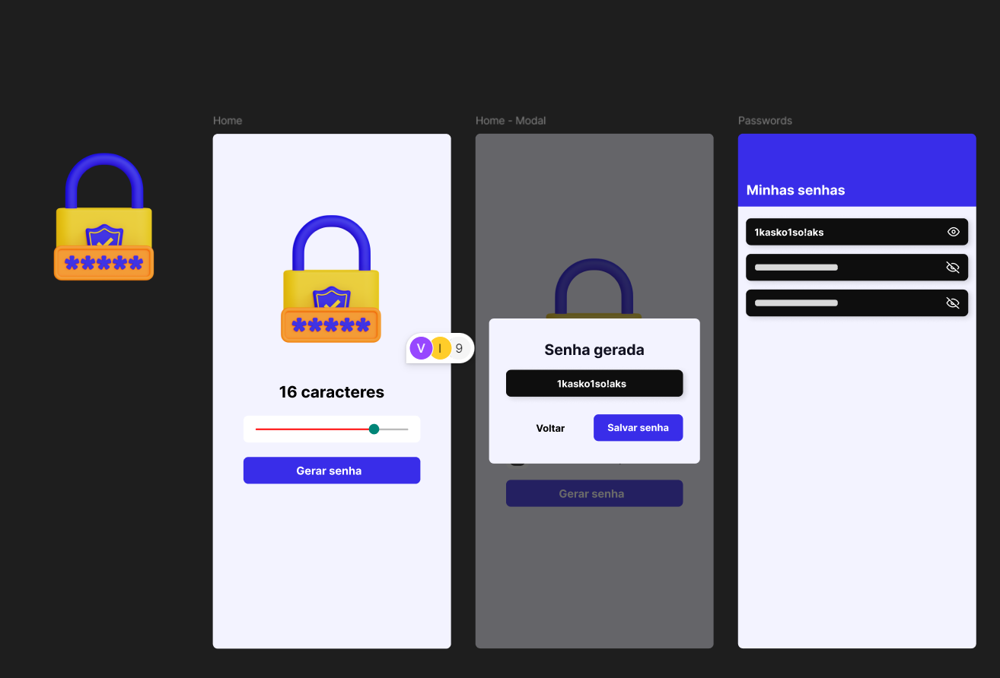

### Image of Software



### Steps to Clone and Run a React Native Project

1. **Install Git:**
   - Make sure Git is installed on your system. You can download and install it from the [official Git website](https://git-scm.com/).

2. **Clone the Repository:**
   - Open the terminal (or command prompt) and run the following command to clone the repository:
     ```bash
     git clone https://github.com/username/repository-name.git
     ```
   - Replace `https://github.com/username/repository-name.git` with the URL of the repository you want to clone.

3. **Navigate to the Project Directory:**
   - Change to the cloned project directory:
     ```bash
     cd repository-name
     ```

4. **Install Dependencies:**
   - Run the following command to install the project's dependencies:
     ```bash
     npm install
     ```
   - Or, if you're using Yarn:
     ```bash
     yarn install
     ```

5. **Set Up the Environment:**
   - Make sure you have the development environment set up. You will need Node.js, Expo (if using), and either Android Studio or Xcode (depending on whether you're running on Android or iOS).
   - Follow the installation instructions for React Native [here](https://reactnative.dev/docs/environment-setup).

6. **Run the Project:**
   - To start the project, use:
     ```bash
     npm run android
     ```
     or
     ```bash
     npm run ios
     ```
   - If using Expo, you can start with:
     ```bash
     expo start
     ```

7. **View on Emulator or Device:**
   - Open an Android or iOS emulator (or use a physical device).
   - Follow the instructions displayed in the terminal to view the app.

### Notes:
- Ensure all prerequisites are installed (Node.js, Watchman, JDK, etc.).
- For Expo projects, you may need the Expo Go app on your mobile device.


# Welcome to your Expo app 👋

This is an [Expo](https://expo.dev) project created with [`create-expo-app`](https://www.npmjs.com/package/create-expo-app).

## Get started

1. Install dependencies

   ```bash
   npm install
   ```

2. Start the app

   ```bash
    npx expo start
   ```

In the output, you'll find options to open the app in a

- [development build](https://docs.expo.dev/develop/development-builds/introduction/)
- [Android emulator](https://docs.expo.dev/workflow/android-studio-emulator/)
- [iOS simulator](https://docs.expo.dev/workflow/ios-simulator/)
- [Expo Go](https://expo.dev/go), a limited sandbox for trying out app development with Expo

You can start developing by editing the files inside the **app** directory. This project uses [file-based routing](https://docs.expo.dev/router/introduction).

## Get a fresh project

When you're ready, run:

```bash
npm run reset-project
```

This command will move the starter code to the **app-example** directory and create a blank **app** directory where you can start developing.

## Learn more

To learn more about developing your project with Expo, look at the following resources:

- [Expo documentation](https://docs.expo.dev/): Learn fundamentals, or go into advanced topics with our [guides](https://docs.expo.dev/guides).
- [Learn Expo tutorial](https://docs.expo.dev/tutorial/introduction/): Follow a step-by-step tutorial where you'll create a project that runs on Android, iOS, and the web.

## Join the community

Join our community of developers creating universal apps.

- [Expo on GitHub](https://github.com/expo/expo): View our open source platform and contribute.
- [Discord community](https://chat.expo.dev): Chat with Expo users and ask questions.
